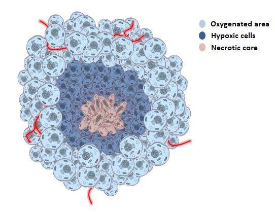
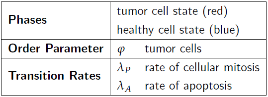
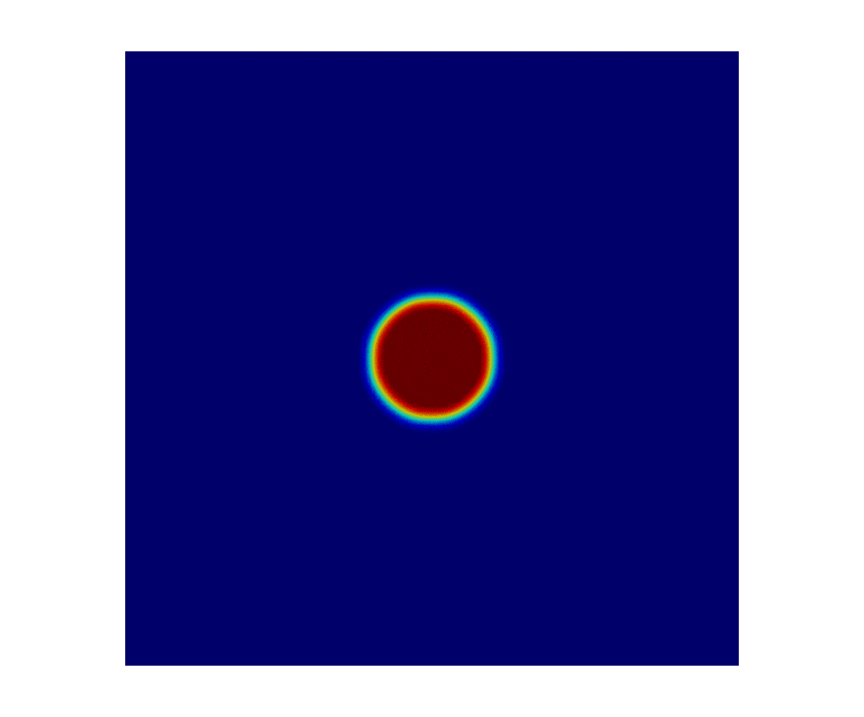
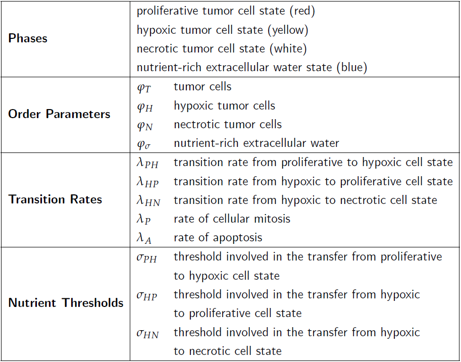

# bachelor-thesis

## Introduction
This is a short overview of the code and the developed models for my bachelor thesis with the title "**Phase Field Methods for Biomedical Growth Processes**". The thesis was written at the *Institute of Mechanics and Computational Mechanics (IBNM)* at the Leibniz University Hannover, Germany. The examinors were *Prof. Dr.-Ing. Dominik Schillinger* and *Prof. Dr.-Ing. Udo Nackenhorst*. The supervisor was *M. Sc. Etienne Jessen*. The thesis was submitted at September 2020 and recieved the grade of 1,0 (german grading system).

The scope of the thesis include the research of the theory of phase field methods and biomedical growth processes. The phase field methods consist of two equations: *Cahn-Hilliard equation* and *Allen-Cahn equation*. The purpose of the thesis was to develop a finite element biomedical tissue growth model with both approaches. The models of the different approaches were then compared to one another and evaluated based on their usability. The developed model was inspired by the model developed by *J. T. Oden* in his 2016 paper *Towards Predictive Multiscale Modeling of Vascular Tumor Growth*. This repository disregards the comparison of the two equations and focuses on the developed models. The abstract below is copy pasted from the thesis. The rest of the text was adjusted for this repository.

## Code and Recources
- Environment: Jupyter Notebook
- Framework: FEniCS Project on Ubuntu 18.04 LTS
- Visualization Tool: ParaView

## Abstract
Phase field methods are a useful tool for describing biomedical growth processes. The conventional way in creating models using these methods is to work with the Cahn-Hilliard equation. This equation has conservation properties, but the computation of the equation comes at a high computational cost. An alternative approach is using the Allen-Cahn equation, which has a lower computational cost but lacks the conservation properties. The purpose of this study is to compare the two phase field approaches in the context of the development of a biomedical tissue growth model. This finite element tumor growth model was developed with both approaches and incorporates an initial stable state and custom defined growth processes. The results of the simulations show no significant differences between the two approaches. Due to its metastable patterns, the Allen-Cahn approach remains stable long enough for the simulation to provide useful results. The quasi-steady state during the short term dynamics, coupled with the lower computational cost compared to the Cahn-Hilliard equation, makes the Allen-Cahn approach a legitimate method in modeling two-dimensional tumor growth if the model incorporates an initial stable state for the tumor. The thesis concludes with a four-phase tumor growth model, which was developed with the Allen-Cahn approach. 

*Keywords*: Finite element method, Phase field model, Biomedical growth process, Tumor growth model, Allen-Cahn equation

## Tumor Growth
Cancer is a group of diseases caused by uncontrolled cell division with the potential to spread to other parts of the body. Every healthy cell in the human body is programmed to multiply and, after a passage of time, to die. The process of cell division for every cell, except for the egg and sperm cells, is called mitosis. During mitosis, a mother cell replicates its genes and divides into two daughter cells, which are genetically identical to each other. Old cells are replaced by these daughter cells as they die. The growth, the instructions to replicate and to die, the decision what type of a cell to be and its function is all regulated by the cells genes. Sometimes changes happen by chance to the DNA in the genes during mitosis, which can mean that the daughter cell may have a gene that has been damaged, lost, or is copied twice. This is called a mutation. Mutations in specific genes can cause the cell to multiply uncontrollably. During this rapid cell division, further mutations can occur. Some genes get damaged regularly and can quickly repair themselves. Furthermore, cells have the ability to self destruct when they become damaged or too old. Mutations in specific genes can inhibit the self destruct ability. With the rapid division, the damage may build up and the cells are less likely to repair the damaged genes. With enough different mutations, a normal cell can turn into a cancer cell. This cancer cell then multiplies uncontrollably, forming a tumor. Sidenote: This thsis focused soley on maligant tumors.

Like the growth of healthy cells, the growth of a tumor is controlled by oxygen and nutrient supply. Solid tumors develop as avascular polyps (an abnormal growth of tissue lacking blood vessels). Small tumors experience exponential growth, as their volume doubles in constant time-steps. As the malignant tumor growths in size, its center gets further away from the blood supply. Being deprived of oxygen and nutrients, the cells at the center die. This results in the tumor having a necrotic core. As a consequence, the growth rate of tumors usually declines as they get larger, since the growth rate depends on the amount of living cancer cells. Due to the oxygen and nutrient starvation, the living tumor cells become hypoxic. That leads them to secret signal proteins, which stimulate the growth of blood vessels into the outer layer of the tumor, such that the supply of oxygen and nutrients is ensured. This process is called angiogenesis. A schematic representation of a multi-cellular solid tumor is depicted in the figure below. There, the oxygenated area (called the proliferative cells) and the connected blood vessels are located at the periphery of the tumor, the center having a necrotic core, with living, oxygen-deprived hypoxic cells in between.

  

## First Iteration - Two Phase Model
The first iteration of the biological model incorporates one order parameter phi, which describes two phases: The 1-phase is the state for the tumor cells and the 0-phase is the state for the healthy cells. It should be noted, that this iteration treats the tumor in only having proliferative cells. This composition mimics the early stages of tumor growth, where all tumor cells receive enough oxygen and nutrients for unrestricted growth so that the necrotic core has not been formed yet. This model also incorporates two transition rates. The first one is lambda_P, which mimics cellular mitosis and is the constant growth rate of the tumor cells by consuming nutrients meaning volume fractions from the healthy cells. The second one is the apoptosis rate lambda_A, which mimics programmed cell death and is the constant rate at which the tumor cells die. The tumor cells which die by apoptosis increase the volume fraction of the healthy cells. A tabular presentation of the phases, order parameter, and the transition rates of the first iteration of the model is depicted in the table below. The color scheme used for the depiction of the phases for this iteration is also included in this table. The model was developed with the Cahn-Hilliard approach and depicts a constant growth of the tumor. 

First iteration parameters            |  First iteration animation
:-------------------------:|:-------------------------:
  |  

## Second Iteration - Four Phase Model
The second iteration of the biological model was developed with the Allen-Cahn approach exclusively and expands the treatment of the tumor from having only one phase to being composed of three separate phases: proliferative cell state, hypoxic cell state and necrotic cell state. The tumor is situated in nutrient-rich extracellular water, which represents the fourth state. This model incorporates four order parameters: phi_T for the whole tumor, phi_H for the hypoxic, phi_N for the necrotic tumor cells and phi_sigma for the nutrient-rich extracellular water. The order parameter for the proliferative tumor cells does not have to be incorporated into the source code of the model, since it can be calculated with the existing order parameters with phi_P = phi_T - phi_H - phi_N. This iteration also expands the number of transition rates from the two already established ones lambda_P and lambda_A to five, introducing the transition rate from proliferative to hypoxic tumor cell state lambda_PH, the one from hypoxic to proliferative tumor cell state lambda_HP and the one from hypoxic to necrotic cell state lambda_HN. Therefore, the dynamics of the tumor growth of this iteration of the model depend not only on the cellular mitosis and apoptosis rate, but also on the availability of nutrients. These newly introduced transition rates become active if their respective nutrient thresholds sigma_PH, sigma_HP and sigma_HN are met. A tabular presentation of the phases, order parameters, transition rates and nutrient thresholds of the second iteration of the model is depicted in the table below. The table also includes the color scheme used for the depiction of the phases for this iteration. The active phases of the order parameter are visible in their respective colors, with the colors fading away into gray if the values of the order parameter approach their passive phases. This ensures a clear visibility of all active phases.

As was the case in the first iteration, proliferative tumor cells are affected by cellular mitosis and apoptosis. Their volume fraction can also increase if the level of nutrients exceeds sigma_HP, which causes them to consume volume fractions of the hypoxic cell state. In addition to the rate of apoptosis, their volume fraction can decrease if the nutrient level drops below sigma_PH, which causes their volume fraction to be consumed by the hypoxic cell state, which is the only way for the hypoxic cell state to grow because they do not proliferate. In addition to losing volume fractions to the proliferative cells and to apoptosis, the hypoxic cells can also lose them to the necrotic core if the nutrient level drops below sigma_HN. The turning of hypoxic cells into necrotic cells is the only way for the necrotic core to grow. The volume of the necrotic core cannot decrease. Cellular mitosis of the proliferative cells consume volume fractions of the nutrient-rich extracellular water. Cells which die by apoptosis return their volume fractions to the extracellular water.

The initial state shows the domain being completely filled with the nutrient-rich extracellular water phase. It also depicts a tumor located at the center, composed of only proliferative cells. The tumor is devoid of any hypoxic and necrotic phases at the initial state. The pink color of the tumor is because the red proliferative phase is located on top of the blue water phase, which is represented by the dilution of the red color. At the beginning of the simulation, the tumor is completely situated in the nutrient-rich extracellular water. After the simulation starts, the tumor consumes the volume fractions of the water and causes the water located beneath the tumor to lose its active phase. This causes the color of the proliferative phase to turn from pink to red. The tumor grows in size with the consumption of nutrients. Once the tumor has consumed all the nutrients it is located on top of, it starts to consume the nutrients at its periphery. This causes the water to lose its active phase around the tumor, which is represented by the gray halo. After the tumor consumed enough nutrients for the water phase to recede far enough, it cannot sustain all proliferative cells with the available nutrients. This causes the growth of the tumor to slow down and its center to be starved of nutrients, resulting in the development of first the hypoxic and then the necrotic phases. Because the tumor does not consume enough nutrients for the unhindered growth of the proliferative phase, the hypoxic phase grows by consuming volume fractions of the proliferative phase, which in turn are consumed by the necrotic phase. This causes the constant growth of the hypoxic and necrotic phases. The final state of the tumor is depicted in the final frame of the animation, in which the domain is in an equilibrium, where the tumor is composed of a large necrotic core, surrounded by a rim of a hypoxic and proliferative phase. In this state, the growth and death rate of the proliferative phase by mitosis and apoptosis cancel each other out. This results in all phases of the tumor to remain in a steady state.

Second iteration parameters            |  Second iteration animation
:-------------------------:|:-------------------------:
  |  
