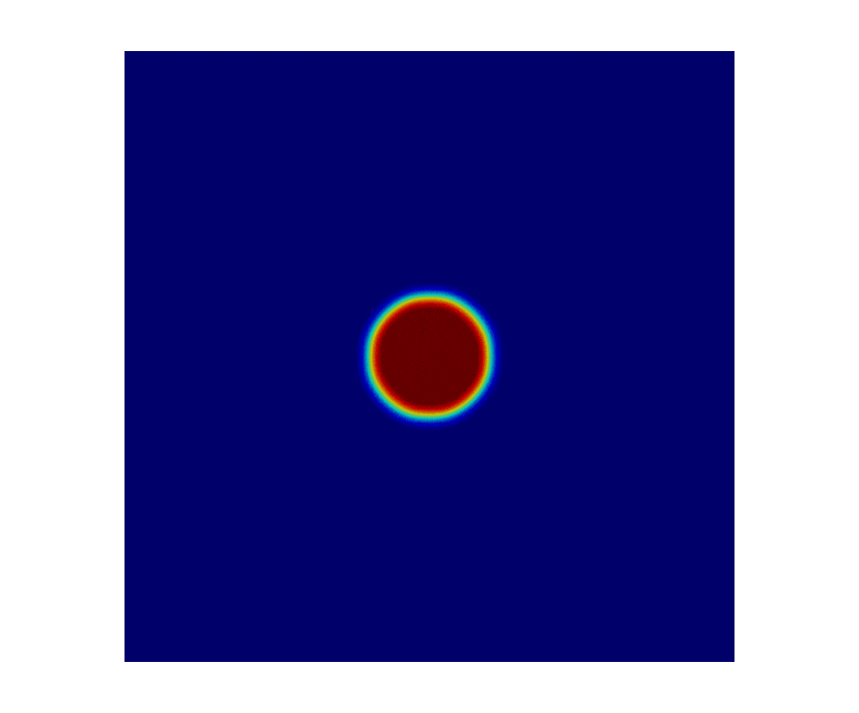

# bachelor-thesis

## Introduction
This is a short overview of the code and the developed models for my bachelor thesis. Its title of it is "**Phase Field Models for Biomedical Growth Processes**". The thesis was written at the *Institute of Mechanics and Computational Mechanics (IBNM)* at the Leibniz University Hannover, Germany. The examinors were *Prof. Dr.-Ing. Dominik Schillinger* and *Prof. Dr.-Ing. Udo Nackenhorst*. The supervisor was *M. Sc. Etienne Jessen*. The thesis was submitted at September 2020 and recieved the grade of 1,0 (german grading system).

The scope of the thesis include the research of the theory of phase field methods and biomedical growth processes. The phase field methods consist of two equations: *Cahn-Hilliard equation* and *Allen-Cahn equation*. The purpose of the thesis was to develop a finite element biomedical tissue growth model with both approaches. The models of the different approaches were then compared to one another and evaluated based on their usability. This repository disregards the comparison of the two equations and focuses on the developed models. The abstract below is copy pasted from the thesis. The rest of the text was adjusted for this repository.

## Code and Recources
- Environment: Jupyter Notebook
- Framework: FEniCS Project on Ubuntu 16.04
- Visualization Tool: ParaView

## Abstract
Phase field methods are a useful tool for describing biomedical growth processes. The conventional way in creating models using these methods is to work with the Cahn-Hilliard equation. This equation has conservation properties, but the computation of the equation comes at a high computational cost. An alternative approach is using the Allen-Cahn equation, which has a lower computational cost but lacks the conservation properties. The purpose of this study is to compare the two phase field approaches in the context of the development of a biomedical tissue growth model. This finite element tumor growth model was developed with both approaches and incorporates an initial stable state and custom defined growth processes. The results of the simulations show no significant differences between the two approaches. Due to its metastable patterns, the Allen-Cahn approach remains stable long enough for the simulation to provide useful results. The quasi-steady state during the short term dynamics, coupled with the lower numerical cost compared to the Cahn-Hilliard equation, makes the Allen-Cahn approach a legitimate method in modeling two-dimensional tumor growth if the model incorporates an initial stable state for the tumor. The thesis concludes with a four-phase tumor growth model, which was developed with the Allen-Cahn approach. 

*Keywords*: Finite element method, Phase field model, Biomedical growth process, Tumor growth model, Allen-Cahn equation

## Tumor Growth
WIP

## First Iteration - Two Phase Model
WIP

## Second Iteration - Four Phase Model
WIP

